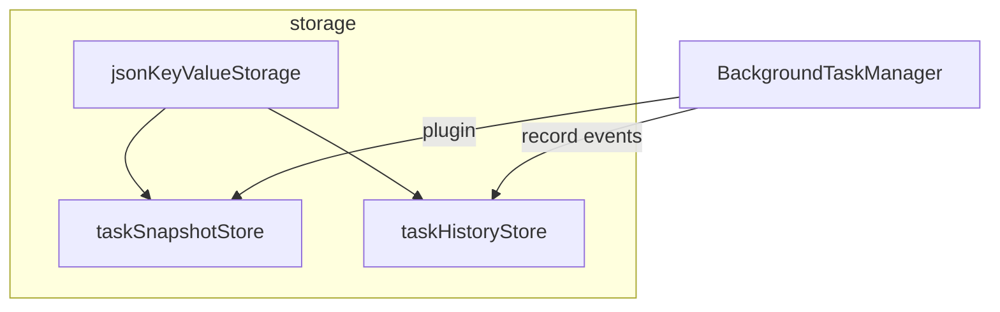

# 任务存储完全重构（状态持久化 + 历史）

## 与前一版差异

不再采用「把 `TaskHistoryManager` 粘进 `taskPersistenceAdapter.ts`」的浅合并，而是 **按域重新切分模块、抽公共存储能力、统一配置与命名**；**允许破坏性 API 调整**，配套更新 demo 与 readme（对外主入口仍以 `@/core` 或包 barrel 为准）。

## 目标架构

新建目录 [`src/core/background-task-manager/storage/`](src/core/background-task-manager/storage/)（名称可微调），职责如下：

| 文件（建议） | 职责 |
|-------------|------|
| `types.ts` | 存储后端枚举、统一 `TaskStorageBackend` / 各 Store 的配置类型、与 `BackgroundTask` 解耦的纯数据类型 |
| `jsonKeyValueStorage.ts` | 浏览器 `Storage` 的同步读写封装（`getItem`/`setItem`、try/catch、JSON parse）；供状态快照与历史共用 |
| `taskSnapshotStore.ts` | **按 `task.id` upsert** 的任务快照（原 `WebStorageAdapter` / `MemoryAdapter` / `IndexedDBAdapter` 逻辑迁入或委托）；实现 `TaskPersistenceAdapter` 接口（名称可改为 `TaskSnapshotStore` 或保留接口名） |
| `taskHistoryStore.ts` | **追加式**历史（原 `TaskHistoryManager` 的内存模型 + query/stats）；持久化通过同一套 `backend` + `storageKey` 策略，**不再写死 `localStorage`** |
| `createStores.ts`（或 `factory.ts`） | `createTaskSnapshotStore` / `createTaskHistoryStore`（或统一 `createTaskStorage(options)` 返回 `{ snapshot, history }`） |
| `persistencePlugin.ts` | `createTaskPersistencePlugin`、`restorePendingFromPersistence`（依赖 snapshot store + `BackgroundTaskManager`） |
| `index.ts` | barrel：对外 re-export |

## 公共行为约定

- **后端对齐**：`localStorage` | `sessionStorage` | `memory` 三类对 **快照** 与 **历史** 使用同一套选择逻辑；**IndexedDB** 仅挂在快照侧（保持现有能力），历史首期可为「仅 WebStorage/memory」或「IndexedDB 单 key 存 JSON 数组」（实施时二选一并在类型上收窄）。
- **异步策略**：快照接口保持 **Promise**（与现有一致）；历史侧建议 **对外 async**（`save`/`load`）以统一「可对接 IO」语义，内部仍可同步写 memory；若需减少破坏性，可保留同步 `record` + 异步 `flush()`。
- **trim 策略**：快照按 `createdAt` 淘汰最旧；历史按条数 FIFO（与现有一致），配置项命名统一（如 `maxSnapshotRecords` / `maxHistoryRecords`）。

## 破坏性变更（可接受范围内）

- 删除根文件 [`taskHistoryManager.ts`](src/core/background-task-manager/taskHistoryManager.ts)、[`taskPersistenceAdapter.ts`](src/core/background-task-manager/taskPersistenceAdapter.ts)，由 `storage/*` 替代。
- 类/工厂重命名示例：`TaskHistoryManager` → `TaskHistoryStore`（或保留旧名作 **deprecated alias** 再导出一版，二选一；完全重构默认 **直接改名** 并改 demo）。
- `createTaskPersistenceAdapter` → `createTaskSnapshotStore`（或保留旧名作为 `export const createTaskPersistenceAdapter = createTaskSnapshotStore` 的别名，降低升级成本——**计划默认：新名为主，旧名 optional alias 一个版本**）。

## 必须修复的逻辑

- [`getTypeStats`](src/core/background-task-manager/taskHistoryManager.ts) 当前返回空实例：重构后按 `type` 过滤条目并计算 `TaskHistoryStats`。

## 引用面更新

- [`background-task-manager/index.ts`](src/core/background-task-manager/index.ts)、[`src/core/index.ts`](src/core/index.ts)、[`src/index.ts`](src/index.ts)：从 `storage` barrel 导出；若有 **deprecated 别名** 在此集中声明。
- [`BackgroundTaskManagerDemo.vue`](playground/demos/background-task-manager/BackgroundTaskManagerDemo.vue)：改用新工厂/类名与可选 async `save`/`load`。
- [`readme.md`](src/core/background-task-manager/readme.md)：重写「持久化 + 历史」章节，反映目录、命名与推荐用法。

## 校验

- `pnpm exec tsc -p tsconfig.json --noEmit`。

## 实施顺序

1. 新增 `storage/types.ts`、`jsonKeyValueStorage.ts`，抽离 WebStorage 读写。
2. 实现 `taskSnapshotStore.ts`（迁移并整理原适配器三实现 + IndexedDB）。
3. 实现 `taskHistoryStore.ts`（迁移历史逻辑 + 统一 backend + 修 `getTypeStats`）。
4. 实现 `persistencePlugin.ts` + `factory`/`index` barrel。
5. 删除旧两文件；更新上层 index、demo、readme。
6. （可选）在 barrel 增加 `createTaskPersistenceAdapter` 等 **一行别名** 文档标注 deprecated。
7. 跑 tsc。
