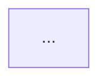

# Task Execution Chain（任务执行链）

本模块提供**可视化任务执行链**能力：记录节点、依赖边、入参/出参、状态与耗时，并输出结构化数据与 **Mermaid** 流程图文本。

## 安装与入口

从包入口统一导出（示例）：

```ts
import {
  TaskExecutionChain,
  TraceEnter,
  TraceCall,
  TraceAll,
  TraceVar,
  createStackTracer,
  createTraceVariable,
  getLastTraceResult,
  TraceStep,
  runTracedFlow,
} from 'hhfast' // 或 '@/index'
```

源码目录：`src/core/task-execution-chain/`。

类型定义拆分文件（实现仍从 `taskExecutionChain.ts` / `taskExecutionStackTracer.ts` 再导出，对外 import 路径不变）：

- `taskExecutionChain.types.ts`：链节点、边、渲染结果与链操作选项
- `taskExecutionChain.flow-types.ts`：`TraceStep` / `runTracedFlow` 相关类型
- `taskExecutionStackTracer.types.ts`：栈追踪与装饰器选项类型

---

## 主要 API 调用示例（表 + 代码）

下表与下方 ````ts` 片段一一对应，便于快速拷贝。

### 速查表

| API | 典型用途 | 说明 |
|-----|----------|------|
| `TaskExecutionChain` | 手动建节点、连线、出图 | `addNode` → `connect` → `startNode` → `completeNode` / `failNode` → `render` |
| `TraceStep` + `runTracedFlow` | 按 `deps` 拓扑执行并自动记链 | 类方法挂元数据后 `runTracedFlow(instance, { input })` |
| `TraceEnter` | 入口内自动追踪 `this.xxx()` | 装饰入口方法；结束用 `getLastTraceResult(this)` |
| `TraceCall` | 入口内显式标记某方法（如封装 `console.log`） | 仅在有 `TraceEnter` 上下文时写入链路 |
| `TraceAll` | 类上默认追踪方法与 accessor | 类装饰器；可用 `exclude` 避免与入口重复 |
| `TraceVar` | 追踪实例字段 get/set | 字段装饰器；需 `TraceEnter` 上下文 |
| `createTraceVariable` | 追踪“局部变量”读写 | 在入口内 `createTraceVariable(this, 初值, 'name')` |
| `createStackTracer` / `TaskExecutionStackTracer` | 不用装饰器，手动嵌套 `trace` | `tracer.trace` 包一层即一层父子边 |
| `getLastTraceResult` | 取上一次 `TraceEnter` 的渲染结果 | `getLastTraceResult(service)` |

### 示例 1：`TaskExecutionChain`（手动）

```ts
import { TaskExecutionChain } from 'hhfast'

const chain = new TaskExecutionChain()
const idA = chain.addNode({ name: '步骤A', type: 'step', input: { x: 1 } })
const idB = chain.addNode({ name: '步骤B', type: 'step', input: { x: 2 } })
chain.connect({ from: idA, to: idB })

chain.startNode(idA)
chain.completeNode(idA, { output: { ok: true } })
chain.startNode(idB)
chain.completeNode(idB, { output: { done: true } })

const out = chain.render({ direction: 'LR' })
// out.nodes / out.edges / out.mermaid
```

### 示例 2：`runTracedFlow`（依赖步骤）

```ts
import { runTracedFlow } from 'hhfast'
// 假设实例上已用 TraceStep 收集步骤元数据

const { resultMap, renderResult } = await runTracedFlow(flowInstance, {
  input: { userId: 1 },
  direction: 'TD',
  stopOnError: true,
})
```

### 示例 3：`TraceEnter` + `getLastTraceResult`

```ts
import { TraceEnter, getLastTraceResult } from 'hhfast'

class Svc {
  @TraceEnter({ name: '业务流程', input: (args) => args[0] })
  async run(payload: { id: number }) {
    return this.step(payload.id)
  }
  async step(id: number) {
    return { id }
  }
}

const svc = new Svc()
await svc.run({ id: 42 })
const trace = getLastTraceResult(svc)
// trace?.mermaid
```

### 示例 4：`TraceCall`（封装 `console.log`）

```ts
import { TraceCall } from 'hhfast'

class Svc {
  @TraceCall({ name: 'console.log', type: 'global', input: (args) => args })
  debug(...args: unknown[]) {
    console.log(...args)
  }
}
// 仅在 TraceEnter 包裹的流程内调用 this.debug(...) 会进链
```

### 示例 5：`TraceAll` / `TraceVar` / `createTraceVariable`

```ts
import { TraceAll, TraceEnter, TraceVar, createTraceVariable } from 'hhfast'

@TraceAll({ namePrefix: 'Demo', exclude: ['run'] })
class Demo {
  @TraceVar({ name: 'counter' })
  counter = 0

  @TraceEnter({ name: '入口' })
  async run() {
    this.counter += 1
    const v = createTraceVariable(this, 0, 'localCounter')
    v.set(v.get() + 1)
  }
}
```

### 示例 6：`createStackTracer`（手动栈）

```ts
import { createStackTracer } from 'hhfast'

const tracer = createStackTracer()
await tracer.trace({ name: '根', input: {} }, async () => {
  await tracer.trace({ name: '子' }, async () => undefined)
})
const rendered = tracer.render()
```

### 示例 7：无装饰器语法时（手动应用装饰器）

```ts
import { TraceEnter } from 'hhfast'

const proto = Service.prototype
const key = 'createOrder'
const desc = Object.getOwnPropertyDescriptor(proto, key)!
TraceEnter({ name: '创建订单' })(proto, key, desc)
Object.defineProperty(proto, key, desc)
```

---

## 一、手动记录：`TaskExecutionChain`

适合完全自控的场景：自行 `addNode`、`connect`、`startNode`、`completeNode` / `failNode`，最后 `render()`。

```ts
const chain = new TaskExecutionChain()
const a = chain.addNode({ name: '步骤 A', type: 'step', input: { id: 1 } })
const b = chain.addNode({ name: '步骤 B', type: 'step', input: { id: 2 } })
chain.connect({ from: a, to: b })

chain.startNode(a)
chain.completeNode(a, { output: { ok: true } })

chain.startNode(b)
chain.completeNode(b, { output: { done: true } })

const { nodes, edges, mermaid } = chain.render({ direction: 'LR' })
```

---

## 二、声明式依赖：`TraceStep` + `runTracedFlow`

在类方法上使用 `@TraceStep` 声明 `deps` / `order`，由 `runTracedFlow` 按拓扑顺序执行并自动写链路。

- `deps`：依赖的步骤 key（方法名字符串）
- `order`：同层排序，**不替代依赖关系**

```ts
class Flow {
  async stepA(ctx: TracedFlowRunContext<{ id: number }>) {
    return { user: ctx.input.id }
  }
  async stepB(ctx: TracedFlowRunContext<{ id: number }>) {
    return { orders: [] }
  }
  async stepC(ctx: TracedFlowRunContext<{ id: number }>) {
    return { ok: true }
  }
}

// 需在工程里开启 TypeScript 装饰器，或使用“手动应用装饰器”方式（见下文）
```

```ts
const result = await runTracedFlow(instance, {
  input: { id: 1 },
  direction: 'TD',
})
// result.resultMap / result.chain / result.renderResult
```

---

## 三、入口自动收集：`TraceEnter`

在**入口方法**上使用 `TraceEnter`：

- 执行期间自动追踪内部 `this.xxx()` 方法调用（通过代理），形成类似调用栈的父子边
- 结束后将渲染结果存到实例上，可用 `getLastTraceResult(instance)` 读取

```ts
class OrderService {
  async createOrder(input: CreateOrderInput) {
    const user = await this.loadUser(input.userId)
    return this.submitOrder(user)
  }
  async loadUser(id: number) { /* ... */ }
  async submitOrder(user: unknown) { /* ... */ }
}
```

**注意：** 全局调用（如 `console.log(...)`）不会自动进链，需要封装成 `this` 方法并配合 `TraceCall`，见下文。

---

## 四、显式步骤：`TraceCall`

仅在 **`TraceEnter` 执行上下文内**生效：给指定方法单独打标（名称、类型、入参映射等）。

适合封装 `console.log`、`fetch`、第三方 SDK 等“外部调用”。

```ts
class OrderService {
  @TraceCall({ name: 'console.log', type: 'global' })
  logPicture(msg: string) {
    console.log(msg)
  }
}
```

---

## 五、类级默认追踪：`TraceAll`

类装饰器：默认对该类原型上的

- **方法**：每次调用记录一步
- **带 getter/setter 的属性**：读/写各记一步

可通过 `include` / `exclude` / `traceMethods` / `traceProperties` 控制范围。

同样依赖 **`TraceEnter` 激活的 tracer 上下文**；若与 `TraceEnter` 的代理追踪重复，可用 `exclude` 排除入口或特定方法。

---

## 六、字段读写：`TraceVar`

用于追踪**实例字段**的 get/set（内部用 WeakMap 存值）。

仅在 **`TraceEnter` 上下文内**写入链路。

---

## 七、局部变量：`createTraceVariable`

TypeScript/JavaScript **不能**给 `let`/`const` 写装饰器，因此用包装器模拟“变量追踪”：

```ts
// 在 TraceEnter 包裹的方法内：
const counter = createTraceVariable(this, 0, 'localCounter')
counter.set(counter.get() + 1)
```

`owner` 须与当前 `TraceEnter` 能关联到活动 tracer 的 `this` 一致（含代理场景，库内已对 `TraceEnter` 的 proxy 做了双绑定）。

---

## 八、手动调用栈：`createStackTracer` / `TaskExecutionStackTracer`

不依赖装饰器，直接 `tracer.trace(...)` 嵌套即可形成父子链。

```ts
const tracer = createStackTracer()
await tracer.trace({ name: '入口', input: { id: 1 } }, async () => {
  await tracer.trace({ name: '子步骤' }, async () => { /* ... */ })
})
const result = tracer.render()
```

---

## 九、装饰器在 Vue / 未开启语法时的用法

若构建未启用 `@Decorator` 语法，可**手动应用**并**写回 descriptor**：

```ts
const desc = Object.getOwnPropertyDescriptor(Proto.prototype, 'createOrder')!
TraceEnter({ name: '创建订单' })(Proto.prototype, 'createOrder', desc)
Object.defineProperty(Proto.prototype, 'createOrder', desc)
```

Playground 示例：`playground/demos/task-execution-chain/TaskExecutionChainDemo.vue`。

---

## 十、Mermaid 与 Markdown

`render()` 返回的 `mermaid` 为**裸源码**。粘贴到 Markdown 时需包在代码块中：

````markdown

````

Demo 中提供“复制可粘贴 Markdown”的拼接方式供参考。

---

## 十一、追踪 `console.log` 的推荐方式

**不建议**全局替换 `console.log`（副作用与并发问题大）。

推荐：

1. 封装 `this.log(...)` + `@TraceCall`，在流程里用 `this.log(...)`；或  
2. 单独建 `TracedConsole` 类，方法上挂 `@TraceCall`，业务注入使用。

---

## 十二、API 一览

| 符号 | 说明 |
|------|------|
| `TaskExecutionChain` | 手动建节点与边 |
| `TraceStep` / `runTracedFlow` | 依赖图驱动执行 |
| `TraceEnter` | 入口 + 自动 `this` 方法链 |
| `TraceCall` | 入口内的显式步骤 |
| `TraceAll` | 类级方法 + 属性 get/set |
| `TraceVar` | 字段 get/set |
| `createTraceVariable` | 局部变量式追踪 |
| `createStackTracer` / `TaskExecutionStackTracer` | 手动 trace 嵌套 |
| `getLastTraceResult` | 取上次 `TraceEnter` 的 `render` 结果 |
| `ChainDiffer` | 链路比较器，检测两次执行的差异 |

---

## 十三、类型导出

主要类型包括：`TaskExecutionNode`、`TaskExecutionRenderResult`、`TraceEnterOptions`、`TraceCallOptions`、`TraceAllOptions`、`TraceVarOptions`、`TracedVariable`、`RunTracedFlowOptions`、`TracedFlowRunContext` 等，均从包入口 `export type` 透出。

---

## 十四、链路比较器：`ChainDiffer`

用于比较两条执行链路的差异，常用于：

- **调试**：对比两次执行的差异
- **回归测试**：验证任务执行是否符合预期
- **性能分析**：对比不同输入的执行路径差异

### 基础用法

```ts
import { ChainDiffer, TaskExecutionChain } from '@/core'

// 静态方法比较
const result = ChainDiffer.diff(chainA, chainB)

if (result.hasDiff) {
  console.log('新增节点:', result.addedNodes)
  console.log('移除节点:', result.removedNodes)
  console.log('修改节点:', result.modifiedNodes)
  console.log('统计摘要:', result.summary)
}
```

### 实例方法比较（可复用配置）

```ts
const differ = new ChainDiffer({
  ignoreTiming: true,   // 忽略时间字段差异
  ignoreErrors: false,  // 比较 error 字段
  ignoreOutput: true,   // 忽略 output 差异
})

const result = differ.compare(chainA, chainB)
```

### 比较结果结构

```ts
interface ChainDiffResult {
  addedNodes: TaskExecutionNode[]      // 新增节点
  removedNodes: TaskExecutionNode[]    // 移除节点
  modifiedNodes: Array<{              // 修改节点
    before: TaskExecutionNode
    after: TaskExecutionNode
    changes: Array<{ field: string; before: unknown; after: unknown }>
  }>
  addedEdges: TaskExecutionEdge[]     // 新增边
  removedEdges: TaskExecutionEdge[]    // 移除边
  nodeDiffs: NodeDiff[]               // 所有节点差异
  edgeDiffs: EdgeDiff[]               // 所有边差异
  hasDiff: boolean                    // 是否有差异
  summary: {                          // 统计摘要
    totalAdded: number
    totalRemoved: number
    totalModified: number
    unchanged: number
  }
}
```

---

## 十五、限制说明

- `TraceEnter` / `TraceCall` / `TraceAll` / `TraceVar` / `createTraceVariable` 的链路记录依赖**当前入口执行期间**的活动 tracer。
- 并发多个入口同时跑同一实例时，请避免共享状态导致上下文混淆；必要时每请求新建 service 实例。
- `TraceAll` 对“仅普通数据字段、无 accessor”的属性无法拦截读写（需 `TraceVar` 或改为 getter/setter）。

更多交互示例见：`playground/demos/task-execution-chain/`。
